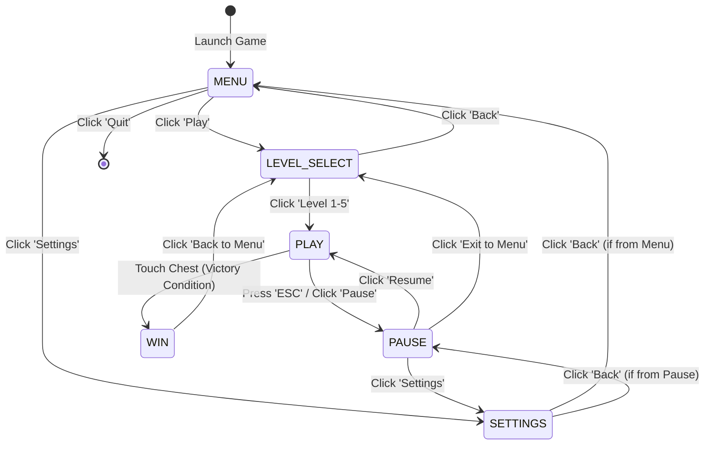

# Hero Shift

Hero Shift is a dynamic 2D puzzle-platformer game built in Python using the Pygame-ce library. The core gameplay revolves around a unique character-switching mechanic where the player must dynamically cycle between three distinct heroes—a Knight, a Ninja, and a Miner—to navigate obstacles, survive environmental hazards, and reach the exit treasure chest of each level.

## Features

* **Dynamic Hero Switching:** Swap between characters on the fly to utilize their unique traits.
* **Distinct Class Systems:**
  * **Knight:** Heavily armored, single jump, completely immune to spike hazards (treats them as solid terrain).
  * **Ninja:** Agile and lightweight, capable of executing an essential double jump.
  * **Miner:** Small stature allowing access to tight paths and narrow tunnels.
* **Environmental Obstacles:** Standard solid terrain, fragile crumbling platforms with visual screen-shake warnings, hazardous spikes, and instant-death zones.
* **Game State Management:** Fully realized persistent progression system featuring full main menu, interactive level selector with locking mechanics, settings panel, in-game pause overlays, and victory states.
* **Robust UI & Audio Control:** Includes an advanced options panel with seamless fullscreen toggling (using aspect-ratio scaling) and a drag-and-drop custom volume slider.

## AI Usage Disclosure
The codebase, architecture design, reStructuredText docstrings, inline code commenting, and markdown documentation files were developed and refined with the technical assistance of generative AI tools.

## Architecture & Game State Diagram

The project eschews a complex structural class architecture in favor of a robust, centralized **Finite State Machine (FSM)**. This state-driven design governs the main game loop, ensuring seamless transitions between menus, active gameplay, and UI overlays. 

Below is the automated State Diagram visualizing the flow of the `current_state` logic:




## Technologies and Tools

* **Language:** Python 3.12+
* **Libraries:** Pygame-CE, PyTMX.
* **Graphics:** Canva (UI & Background), Piskel (Pixel Art Assets).
* **Map Editor:** Tiled Map Editor.
* **IDE:** Visual Studio Code.

## How to Run the Game

There are two ways to play Hero Shift, depending on your preference:

### Option 1: Standalone Executable (No Python Required)
If you just want to play the game without setting up a programming environment:
1. Go to the [Releases](../../releases/latest) page of this repository.
2. Download the latest `HeroShift_Windows.zip` file.
3. Extract the archive to your computer.
4. Ensure that the `assets` folder is located in the exact same directory as the executable.
5. Double-click `HeroShift.exe` to launch the game!

### Option 2: Run from Source Code
If you want to view the code or modify the game:
1. Ensure you have Python 3.12 or newer installed.
2. Clone this repository to your local machine.
3. Install the required dependencies:
   ```bash
   pip install -r requirements.txt

4. Run the game:
   ```bash
   python src/main.py

## Controls
* A / D or Arrow Keys: Move left/right.

* W / Spacebar or Up Arrow: Jump.
  
* 1 / 2 / 3: Switch Hero (1: Knight, 2: Ninja, 3: Miner).

* ESC: Return to menu / Level selection.
